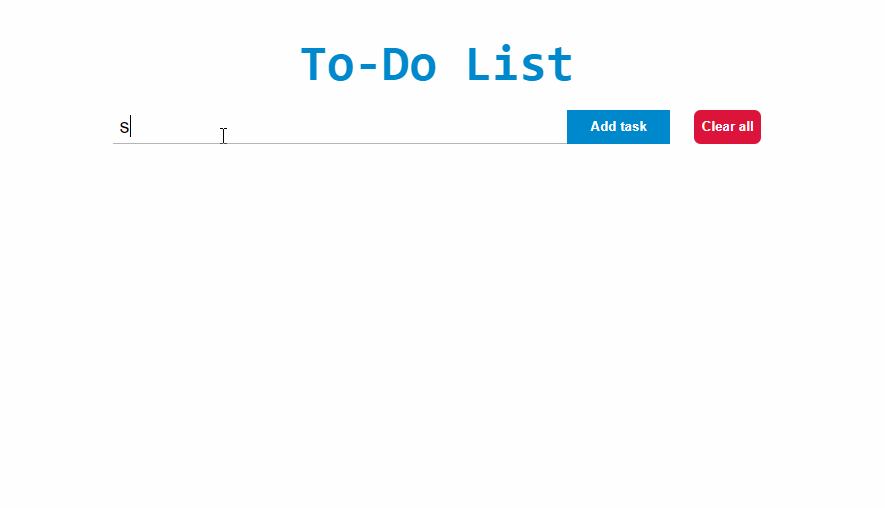

# To-do list
---

<h1></h1>

## About

The **To-do list** project was reproduced for educational purposes, with the main goal of improving concepts from the React library, JavaScript and HTML/CSS. It's a very basic project, but it's awesome to understand fundamental concepts.

---

## Technologies used

This project was made using the following technologies:

- JavaScript
- React.js
- React hooks
- HTML and CSS (Flexbox)
---

## How to download this project

```bash

    # clone the repository
    git clone https://github.com/RicardoPellegrini/todo-list.git

    # change the directory
    cd todo_list

    # install the dependencies using yarn
    yarn install

    # initialize the project
    yarn start
```